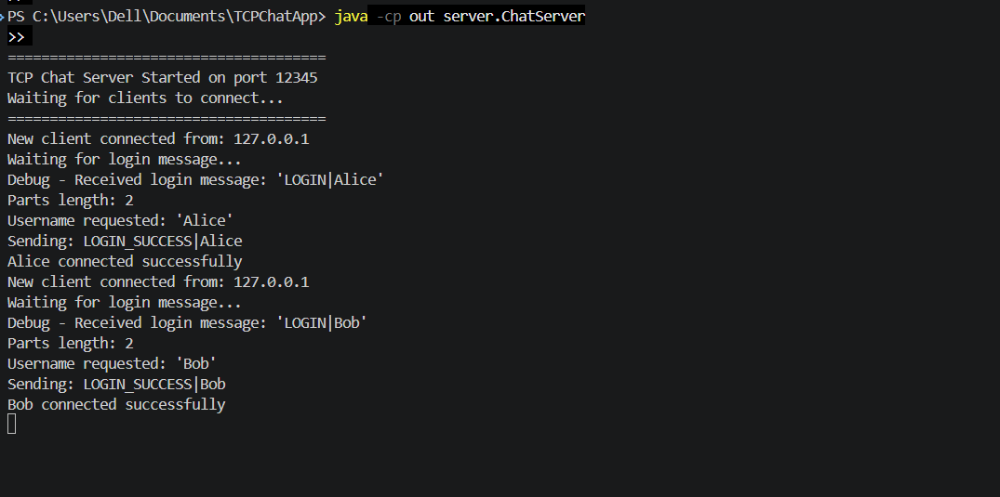
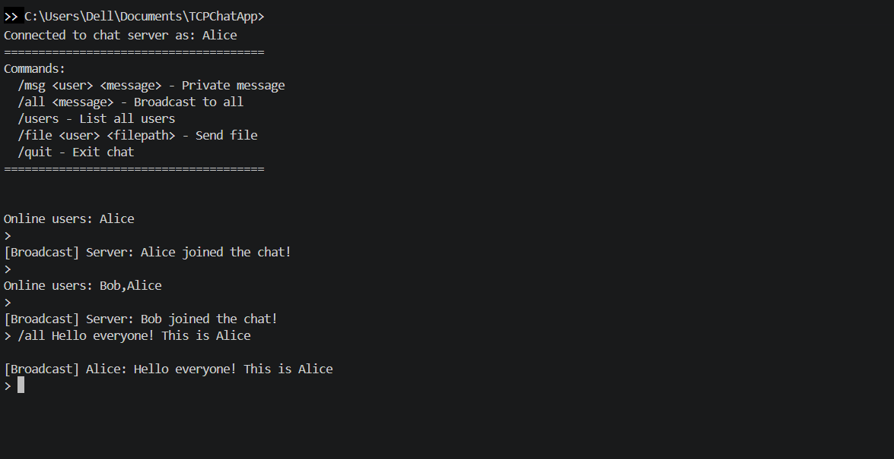
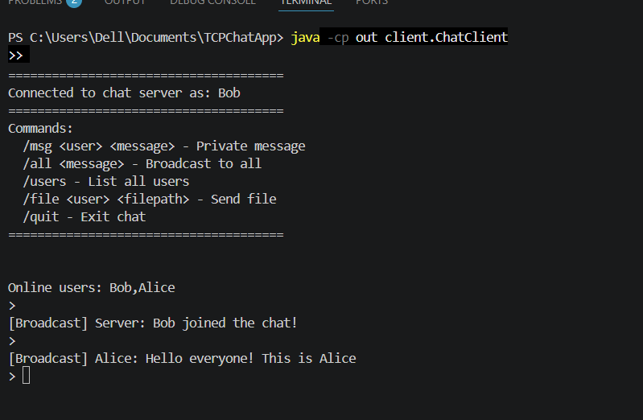
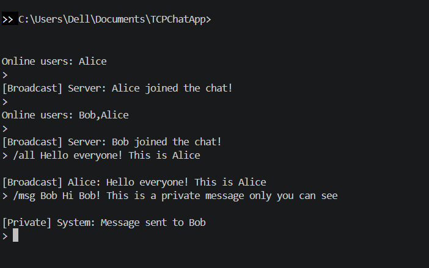
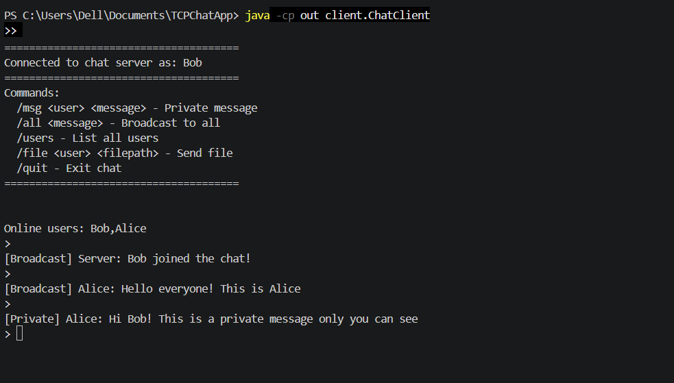
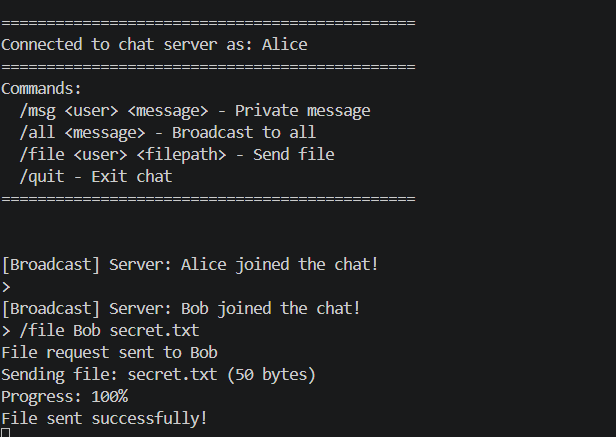
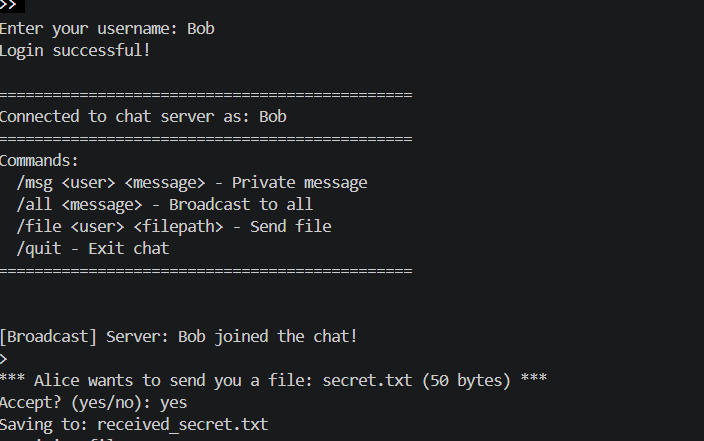

# TCP Chat & File Sharing Application

A multi-client chat application built using Java Socket Programming and TCP/IP.
The application supports real-time messaging, private messaging, broadcast communication, and file sharing between connected clients using a multithreaded client-server architecture.

---

# Features

* Real-time chat communication
* Multi-client support
* Private messaging
* Broadcast messaging
* File sharing between users
* Multithreaded client handling
* Online user management
* TCP-based reliable communication

---

# Technologies Used

* Java
* TCP/IP Socket Programming
* Multithreading
* ConcurrentHashMap
* Base64 Encoding

---

# Project Architecture

```text
                    SERVER (Port 12345)
        ┌───────────────────────────────────┐
        │            ChatServer             │
        │     Accepts Client Requests       │
        └───────────────────────────────────┘
                        │
        ┌───────────────┼───────────────┐
        │               │               │
 ┌─────────────┐ ┌─────────────┐ ┌─────────────┐
 │ClientHandler│ │ClientHandler│ │ClientHandler│
 │   Thread    │ │   Thread    │ │   Thread    │
 └─────────────┘ └─────────────┘ └─────────────┘
        │               │               │
    ┌───────┐       ┌───────┐       ┌───────┐
    │Client │       │Client │       │Client │
    │ Alice │       │  Bob  │       │ Carol │
    └───────┘       └───────┘       └───────┘
```


---

# Project Structure

```text
TCPChatApp/
├── src/
│   ├── common/
│   │   └── Protocol.java
│   ├── server/
│   │   ├── ChatServer.java
│   │   ├── ClientHandler.java
│   │   └── ClientManager.java
│   └── client/
│       └── ChatClient.java
├── out/
└── README.md
```

---

# How to Run

## Compile the Project

```bash
javac -d out src/common/*.java src/server/*.java src/client/*.java
```

## Run Server

```bash
java -cp out server.ChatServer
```

## Run Client

Open another terminal:

```bash
java -cp out client.ChatClient
```

Run multiple clients in separate terminals.

---

# Commands

| Command                   | Description          |
| ------------------------- | -------------------- |
| `/msg <user> <message>`   | Send private message |
| `/all <message>`          | Broadcast message    |
| `/users`                  | Show online users    |
| `/file <user> <filepath>` | Send file            |
| `/quit`                   | Exit application     |

---

# Screenshots

## Server

*Add screenshot here*





---

## Broadcast Messaging

*Add screenshot here*






---

## Private Messaging

*Add screenshot here*






---

## File Sharing

*Add screenshot here*






---

# Key Concepts Used

* TCP Socket Communication
* Client-Server Architecture
* Multithreading
* Concurrent Client Handling
* File Transfer using Base64 Encoding
* Thread-safe Data Structures

---

# Future Improvements

* GUI using JavaFX/Swing
* End-to-end encryption
* Group chat rooms
* Voice/video communication
* Cloud deployment

---

# Author

Shweta Verma
